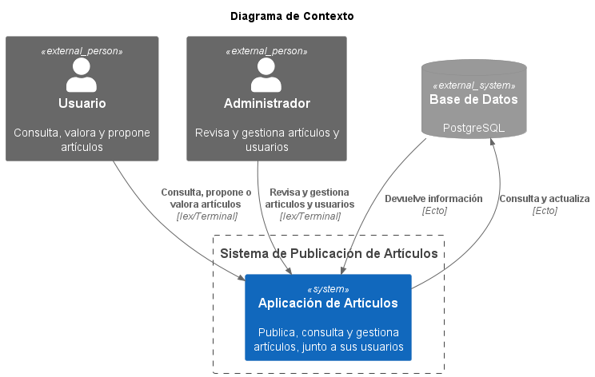
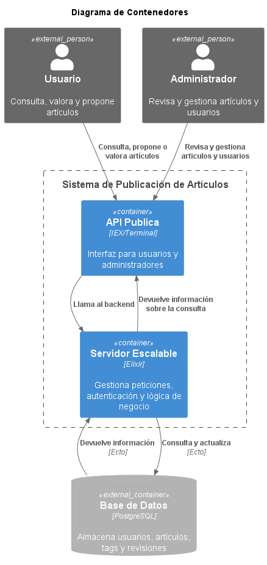
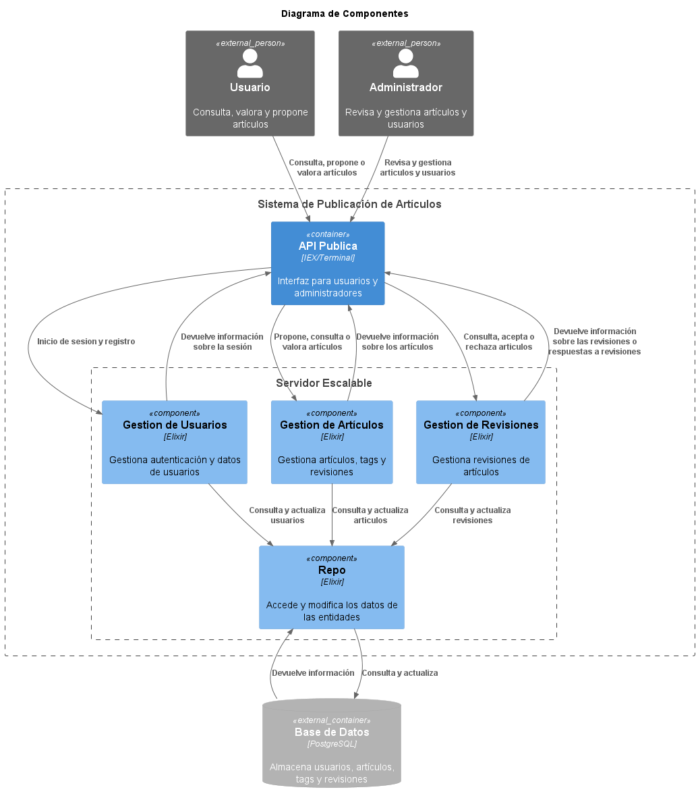

#  1. Documentación de la Aplicación

## 1.1 Requisitos Funcionales

El sistema permite a los usuarios interactuar con artículos académicos o de divulgación. Las funcionalidades incluyen:

-  Consultar artículos publicados.
-  Publicar un nuevo artículo (requiere revisión).
-  Modificar artículos previamente enviados (requiere nueva revisión).
-  Valorar artículos publicados.
-  Filtrar artículos por etiquetas (tags).
-  Los administradores podrán aprobar, rechazar o pedir cambios en las publicaciones.

---

## 1.2 Requisitos No Funcionales

- **Alta disponibilidad**:  
  El sistema debe seguir funcionando ante fallos puntuales, evitando downtime.

- **Escalabilidad**:  
  La arquitectura debe soportar crecimiento horizontal y distribución de carga.

- **Seguridad**:  
  Control de acceso: solo los administradores pueden validar publicaciones.

- **Testabilidad**:  
  El diseño debe facilitar los tests unitarios, de integración y exploratorios.

- **Rendimiento aceptable**:  
  Tiempo de respuesta inferior a 500 ms en situaciones normales de uso.


---

## 1.3 Casos de Uso

### Caso de uso: Crear usuario
- **Actor principal**: Usuario no registrado / Administrador
- **Descripción**: Se crea una cuenta para un nuevo usuario. También se utiliza para registrar administradores.
- **Flujo principal**:
  1. El actor proporciona un nombre de usuario, contraseña y rol deseado.
  2. El sistema verifica que el nombre de usuario no exista previamente.
  3. Si es válido, el sistema almacena al nuevo usuario en la base de datos.

---

### Caso de uso: Eliminar usuario
- **Actor principal**: Administrador
- **Descripción**: Permite eliminar una cuenta de usuario existente.
- **Flujo principal**:
  1. El administrador solicita eliminar a un usuario por su nombre.
  2. El sistema busca al usuario.
  3. Si lo encuentra, elimina el registro de la base de datos.

---

### Caso de uso: Iniciar sesión
- **Actor principal**: Usuario
- **Descripción**: Verifica las credenciales de un usuario y genera una sesión si son válidas.
- **Flujo principal**:
  1. El usuario introduce su nombre y contraseña.
  2. El sistema verifica las credenciales.
  3. Si son válidas, se genera un token de sesión y se devuelve al usuario.
  
---

### Caso de uso: Consultar artículo
- **Actor principal**: Usuario anónimo o registrado
- **Descripción**: Consulta artículos y aplica filtros
- **Flujo principal**:
  1. Accede al listado de artículos.
  2. Aplica filtros por tags si lo desea.
  3. Selecciona un artículo y visualiza su contenido.
  4. Si está registrado, puede dejar una valoración del artículo.

---

### Caso de uso: Publicar artículo
- **Actor principal**: Usuario registrado
- **Descripción**: Publica un nuevo artículo para su revisión
- **Flujo principal**:
  1. Redacta y envía el artículo.
  2. El sistema lo marca como “pendiente”.
  3. Un administrador revisa y decide.

---

### Caso de uso: Modificar artículo
- **Actor principal**: Usuario registrado
- **Descripción**: Modifica uno de sus artículos enviados
- **Flujo principal**:
  1. Edita su artículo.
  2. El sistema lo vuelve a marcar como “pendiente”.
  3. Se requiere nueva revisión y aprobación.

---

### Caso de uso: Revisar artículo
- **Actor principal**: Administrador del sistema
- **Descripción**: Se revisa un artículo antes de su publicación
- **Flujo principal**:
  1. El artículo entra a la cola.
  2. El sistema asigna a un administrador el artículo para que lo revise.
  3. El administrador decide si se publica o no.

---

# 2. Diseño de la aplicación

## 2.1 Diagramas C4

### Diagrama de Contexto


---

### Diagrama de Contenedor


---

### Diagrama de Componentes


---

## 2.2 Decisiones de diseño

[Decisión 01](Decisiones/ADR-01.md)

[Decisión 02](Decisiones/ADR-02.md)

[Decisión 03](Decisiones/ADR-03.md)

[Decisión 04](Decisiones/ADR-04.md)


# 3. Instrucciones

Para que el proyecto funcione correctamente debemos tener instalado **PostgreSQL**. Además, siguiendo la configuración
del proyecto debemos tener:

| Campo        | Valor     |
|--------------|-----------|
| Usuario      | asuser    |
| Contraseña   | as        |
| Base de datos| asuser    |

Una vez hecho esto, primero iniciamos la base de datos asegurando que no quedaron datos de otras ejecuciones

|                     |                                     |
|---------------------|-------------------------------------|
| `mix ecto.drop`     | Elimina la base de datos existente  |
| `mix ecto.create`   | Crea una nueva base de datos        |
| `mix ecto.migrate`  | Aplica las migraciones pendientes   |

Finalmente iniciamos la consola interactiva: `iex -S mix`. A partir de aquí se llamarían a las funciones según el cliente
o administrador quiera

Para la demostración usada en la presentación se hizo:

1. `{:ok, user} = ArticleManagement.UserManager.create_user("john_doe", "password123")` Para crear usuario
2. `{:ok, session} = ArticleManagement.UserManager.login("john_doe", "password123")` Para logearse como el usuario
3. `user = ArticleManagement.UserManager.get_user_by_token(session.token)` Para guardar las variables que usaremos
4. 
    ```
      attrs = %{                                                             
        title: "Artículo de prueba",                                         
        content: "Contenido de ejemplo.",                                    
        author_id: user.id                                                   
      }
    ```
    Para crear las variables del artículo

5. `{:ok, article} = ArticleManagement.ArticleManager.create_article(attrs)` Para mandar el articulo a revisión
6. ` ArticleManagement.ArticleManager.list_articles` Para ver todos los artículos (como no se aprobó todavía no debería salir nada)


7. `{:ok, admin} = ArticleManagement.UserManager.create_user("admin_user", "supersecurepass", :admin)` Para crear al administrador
8. `{:ok, session} = ArticleManagement.UserManager.login("admin_user", "supersecurepass")` Para logearse como el administrador
9. `admin = ArticleManagement.UserManager.get_user_by_token(session.token)` Para guardar las bariables del administrador
10. `ArticleManagement.ReviewPipeline.assign_article_to_admin()` Para decirle al sistema que si hay artículos, los asigne a los admins
11. `{:ok, article} = ArticleManagement.ReviewPipeline.get_assigned_article(admin.id)` Para ver que artículo tenemos asignado
12. `ArticleManagement.ReviewPipeline.review_article(admin.id, article.id, :accept)` Para aceptar el artículo
13. ` ArticleManagement.ArticleManager.list_articles` Para ver todos los artículos (como ahora si se aprobó todavía debería salir
      el artículo)


# 4. Tests

En nuestra aplicación se realizaron distintos tipos de pruebas para verificar el funcionamiento de la aplicación:
* Pruebas de unidad que verifican el funcionamiento de funciones aisladas. 
* Pruebas de integridad en las intervienen varios módulos (UserManager y ArticleManager). 
* Pruebas en la base de datos para verificar inserciones, modificaciones y eliminaciones
* Pruebas de Autenticación para validar que el usuario se autentique correctamente.

Los escenarios que se cubren son los siguientes:

* **Articulos**
  * Listar artículos existentes.

  * Obtener un artículo por su ID.

  * Crear artículos validando existencia y permisos del autor.

  * Actualizar artículos existentes.

  * Eliminar artículos de la base de datos.

* **Usuarios**
  * Crear usuarios nuevos con verificación de duplicados.

  * Eliminar usuarios existentes.

  * Obtener usuarios por nombre.

  * Validar roles (admin, user) para permisos de acción.

* **Autenticación y sesiones**
  * Login exitoso genera token de sesión.

  * Logout elimina el token de sesión.

  * Autenticación de acciones usando token.

  * Validación de roles para autorización.

 # 5. Tácticas

 Este apartado resume las tácticas de arquitectura implementadas en el sistema , clasificadas por sus objetivos de calidad: seguridad, disponibilidad, rendimiento e integración.

---

## Tácticas de Seguridad

- **Autenticación y autorización basada en roles**  
	Se controla el acceso a operaciones según el rol del usuario (`:user`, `:admin`).

- **Contraseñas cifradas y sesiones seguras**  
	Contraseñas almacenadas como hash (Bcrypt). Las sesiones se gestionan con tokens y se almacenan en memoria con ETS.

---

## Tácticas de Disponibilidad

- **Persistencia del estado de la cola de moderación**  
	Se evita el uso de memoria volátil para mantener la cola: los artículos pendientes se consultan directamente desde la base de datos en orden cronológico (`status: :pending_review`).

- **Reinicio automático de procesos críticos**  
	El supervisor OTP reinicia automáticamente procesos como `UserManager` si fallan, evitando caída del sistema.

---

## Tácticas de Rendimiento

- **FIFO para asignación de artículos**  
	La revisión de artículos se realiza en orden de llegada (First-In First-Out), minimizando el tiempo de espera.

- **Procesamiento concurrente**  
	Módulos como `UserManager` utilizan procesos (ETS + Supervisor) para gestionar sesiones de forma eficiente y concurrente.

---

## Tácticas de Integración

- **Compartición de fuentes de datos**  
	Todos los módulos acceden a un repositorio común (`PostgreSQL` mediante `Ecto`), permitiendo consistencia y cohesión.


