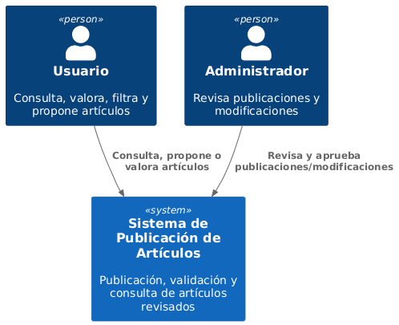
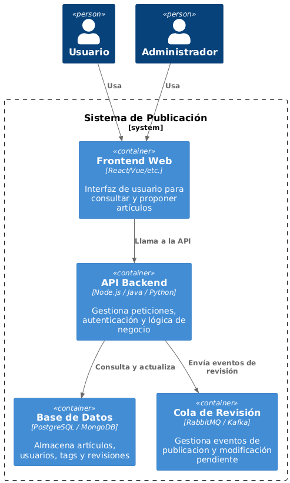

#  1. Documentación de la Aplicación

## 1.1 Requisitos Funcionales

El sistema permite a los usuarios interactuar con artículos académicos o de divulgación. Las funcionalidades incluyen:

-  Consultar artículos publicados.
-  Publicar un nuevo artículo (requiere revisión).
-  Modificar artículos previamente enviados (requiere nueva revisión).
-  Valorar artículos publicados.
-  Filtrar artículos por etiquetas (tags).
-  Los administradores podrán aprobar, rechazar o pedir cambios en las publicaciones.

---

## 1.2 Requisitos No Funcionales

- **Alta disponibilidad**:  
  El sistema debe seguir funcionando ante fallos puntuales, evitando downtime.

- **Escalabilidad**:  
  La arquitectura debe soportar crecimiento horizontal y distribución de carga.

- **Seguridad**:  
  Control de acceso: solo los administradores pueden validar publicaciones.

- **Testabilidad**:  
  El diseño debe facilitar los tests unitarios, de integración y exploratorios.

- **Rendimiento aceptable**:  
  Tiempo de respuesta inferior a 500 ms en situaciones normales de uso.

---

## 1.3 Casos de Uso

### Caso de uso: Crear usuario
- **Actor principal**: Usuario no registrado / Administrador
- **Descripción**: Se crea una cuenta para un nuevo usuario. También se utiliza para registrar administradores.
- **Flujo principal**:
  1. El actor proporciona un nombre de usuario, contraseña y rol deseado.
  2. El sistema verifica que el nombre de usuario no exista previamente.
  3. Si es válido, el sistema almacena al nuevo usuario en la base de datos.

---

### Caso de uso: Eliminar usuario
- **Actor principal**: Administrador
- **Descripción**: Permite eliminar una cuenta de usuario existente.
- **Flujo principal**:
  1. El administrador solicita eliminar a un usuario por su nombre.
  2. El sistema busca al usuario.
  3. Si lo encuentra, elimina el registro de la base de datos.

---

### Caso de uso: Iniciar sesión
- **Actor principal**: Usuario
- **Descripción**: Verifica las credenciales de un usuario y genera una sesión si son válidas.
- **Flujo principal**:
  1. El usuario introduce su nombre y contraseña.
  2. El sistema verifica las credenciales.
  3. Si son válidas, se genera un token de sesión y se devuelve al usuario.
  
---

### Caso de uso: Consultar artículo
- **Actor principal**: Usuario anónimo o registrado
- **Descripción**: Consulta artículos y aplica filtros
- **Flujo principal**:
  1. Accede al listado de artículos.
  2. Aplica filtros por tags si lo desea.
  3. Selecciona un artículo y visualiza su contenido.
  4. Si está registrado, puede dejar una valoración del artículo.

---

### Caso de uso: Publicar artículo
- **Actor principal**: Usuario registrado
- **Descripción**: Publica un nuevo artículo para su revisión
- **Flujo principal**:
  1. Redacta y envía el artículo.
  2. El sistema lo marca como “pendiente”.
  3. Un administrador revisa y decide.

---

### Caso de uso: Modificar artículo
- **Actor principal**: Usuario registrado
- **Descripción**: Modifica uno de sus artículos enviados
- **Flujo principal**:
  1. Edita su artículo.
  2. El sistema lo vuelve a marcar como “pendiente”.
  3. Se requiere nueva revisión y aprobación.

---

### Caso de uso: Revisar artículo
- **Actor principal**: Administrador del sistema
- **Descripción**: Se revisa un artículo antes de su publicación
- **Flujo principal**:
  1. El artículo entra a la cola.
  2. El sistema asigna a un administrador el artículo para que lo revise.
  3. El administrador decide si se publica o no.

---

# 2. Diseño de la aplicación

## 2.1 Diagramas C4

### Diagrama de Contexto

---

### Diagrama de Contenedor

---

### Diagrama de Componentes

---

## 2.2 Decisiones de diseño

[Decisión 01](Decisiones/ADR-01.md)

[Decisión 02](Decisiones/ADR-02.md)

[Decisión 03](Decisiones/ADR-03.md)

# 3. Instrucciones

( Instrucciones para compilar, desplegar, utilizar, ejecutar los tests, ... )

# 4. Tests

( Tipos de tests )

( Escenarios cubiertos por las pruebas )

( Escenarios no cubiertos por las pruebas )
